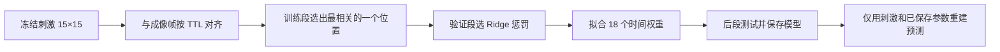

# 毕业设计讲解稿：可解释的 Dm8 视觉刺激响应预测模型

## 一句话定位

本毕业设计使用现有五次 Dm8 实验记录，建立一个可以运行、可以复现预测、可以指出**刺激的哪个位置和哪个时间窗口重要**的模型。任务限定为单一刺激条件下的时空响应；不使用基因型参数，也不需要新增实验数据。

**建议题目**：基于随机视觉刺激的 Dm8 神经响应可解释建模与验证。

## 1. 数据是什么

五次记录各保存 9,000 次 15×15 二值图案更新，更新频率 15 Hz；同时有显示 TTL、显微镜 TTL 和 ImageJ 风格的 `Results.csv`。每个 `MeanN` 是一个 ROI 的逐帧**平均强度**。本项目按约定将这些记录作为 Dm8 数据，预测目标就是该平均强度；它不被改写成 ΔF/F 或放电频率。五次记录共有 236 个 ROI。软件命令的暗/亮灰度是 0/100，存储数组用 −1/+1 表示；每格标称 4°。光的物理波长和辐照度不作为模型参数。

模型对齐使用同一采集设备上的 DLP 与 Zeiss 微秒时钟。对于成像帧 `t`，先找出在该帧之前已经展示的最近刺激更新 `u(t)`；只用过去的图案，避免用未来刺激预测过去响应。

## 2. 模型如何工作



一个 ROI 使用一个位置 `p`，以及这个位置当前和过去 17 次更新的刺激：

\[
\widehat y_t=b+\sum_{\ell=0}^{17}w_\ell S_{u(t)-\ell,p}.
\]

- `S` 是 −1/+1 的数字刺激；+1 对应软件命令的亮灰度 100。
- `p` 告诉我们**哪里**重要，18 个 `w` 告诉我们**何时**、**向哪个方向**影响预测。
- `b` 是基线强度。Ridge 只约束 18 个权重，减少噪声下权重剧烈摆动。

先在最早 50% 的可用帧上为 225 个位置计算刺激与目标的训练期相关，再选一个位置。隔开 18 个成像帧，用后面的验证段选惩罚系数；重新用训练加验证段拟合。再隔开 18 帧，剩余约 30% 只用于计算成绩。这个时间划分用于减少相邻帧的相关性造成的乐观估计。

## 3. 最适合讲解的实例

示例选择 fly1 的 Mean29。训练与验证段分别估计的位置都为存储矩阵 `(9, 7)`，按随包附带的方向标定换成果蝇侧网格 `(5, 7)`。其截距约为 **13.52 原始强度单位**；18 个时间权重都为负，绝对值在更新后约 1–2 个 15 Hz 步长达到最大，随后逐渐衰减。例如第一个延迟步长的权重约为 **−0.37**；如果只改变该步长的数字刺激，从 −1 变到 +1，而其他项固定，模型预测约下降 **0.74 强度单位**。

这说明在模型的数字刺激定义下，该局部亮命令与随后较低的记录强度相关。它是**模型关系**，不需要解释为某种特定受体、光谱机制或神经因果作用。时间峰值也是以 Zeiss frame-out TTL 为代理的近似滞后。

Mean29 在 2,413 帧后段测试中的相关系数为 **0.493**，R² 为 **0.235**。R² 可以通俗解释为：与使用测试段自身平均值的常数参照相比，模型解释了约 23.5% 的该测试段强度变化。前、后两半测试 R² 分别为 0.207 和 0.228，说明结果没有只集中在测试段的某一小段。它相对训练加验证均值常数预测的 R² 约 −0.001；随机循环错位时间的对照也远弱于正确对齐。

可打开生成图 `outputs/pixel_raw/example_pixel_model.svg`：左边是空间位置，中间是 18 个时间权重，右边是 20 秒真实记录与模型预测。答辩时建议先展示位置，再展示权重，最后展示预测曲线及 R²。

## 4. 如实展示全体结果

这个简洁模型**不是所有 ROI 都有效**。五次记录全部 236 个 ROI 的测试 R² 中位数均低于 0；按验证 R² > 0.05 作描述，有 13 个候选，其中 10 个测试 R² 为正。另两个可举例的 ROI：fly4/Mean34 测试 R² = 0.115，fly5/Mean36 = 0.156，且各自的训练、验证最佳像素位置一致。负结果与正结果一起展示，说明模型适合捕捉一部分有局部可预测信号的 ROI，不能宣称对全部 ROI 通用。

本项目在同一批数据上经历了探索性模型比较；因此测试成绩应表述为**现有数据的时间分段验证**，不要称作完全未触及的新实验泛化。五次记录还用了同一冻结随机刺激。以上是使用边界，不妨碍毕业设计展示模型和解释方法。

## 5. 答辩现场怎么运行

在仓库根目录、Python 环境安装完成后：

```bash
.venv/bin/python -m unittest discover -s tests -v
.venv/bin/dm8-model --data-root /Users/irin/Documents/Dm8_module \
  --model pixel --output-dir outputs/pixel_raw
.venv/bin/python scripts/validate_pixel_model.py --results-dir outputs/pixel_raw
.venv/bin/dm8-predict --data-root /Users/irin/Documents/Dm8_module \
  --model-file outputs/pixel_raw/fly1/20260619_105040/pixel_model.npz \
  --roi Mean29 --output-csv outputs/demo_fly1_Mean29.csv
```

最后一条命令读取保存的像素位置、18 个权重和截距；**预测计算只使用刺激历史**，并与模型文件中原先保存的预测逐值核对。命令另读取实测强度用于展示和评分。输出的 CSV 有时间、预测强度和实测强度三列。`pixel_model.npz` 是可复用的拟合参数文件；`pixel_metrics.json` 包含逐 ROI 成绩；`validation.json` 给出汇总和示例区间。所有派生结果写在被 Git 忽略的 `outputs/`，原实验数据只读。

## 6. 两分钟口头讲解示例

> 我的目标是用随机视觉刺激预测 Dm8 记录的响应，并且能够解释模型为什么这样预测。每次实验保存了 15×15 的二值刺激序列和与之同步的 ROI 平均强度。我先利用硬件 TTL 将刺激和成像帧对齐，只保留成像之前的刺激。为了避免 225 个位置全部拟合造成噪声，我只在训练段选择与一个 ROI 最相关的一个位置，再拟合该位置过去 18 次刺激更新的权重。位置回答“哪里重要”，权重回答“多快、方向如何”。以 fly1 的 Mean29 为例，所选位置在训练和验证段一致；其后段测试相关系数约 0.49，R² 约 0.24，且时间权重整体为负。我同时报告全部 236 个 ROI，发现多数 ROI 预测较弱，因此结论是这个简洁模型能刻画部分局部响应，而不是适合所有 ROI。模型参数已保存，可以仅根据刺激重新生成预测结果。

## 7. 常见提问与回答

**为什么用单个像素，不直接用深度神经网络？** 当前目标是可解释性。单像素位置和 18 个时间权重能直接画出并解释；全空间初步基线在多数 ROI 表现较弱。深度网络可作后续性能比较，但不应遮盖本设计的主要贡献。

**R² = 0.235 算不算成功？** 对示例 ROI，它表示在后段记录中有可量化、可复现的预测信号；它不是“所有 Dm8 ROI 都解释了 23.5%”。本设计同时展示总体弱结果。

**为什么要留时间间隔？** 相邻成像帧和刺激历史高度相关。训练、验证、测试段之间各隔开 18 帧，降低直接的历史窗口重叠。

**能不能解释成 UV 波长偏好？** 不能。数据只有这一个命名条件，数字亮度与实际波长/辐照度不是同一件事。本模型解释的是保存的二值视觉图案与 ROI 强度的关系。

**是否必须知道基因型？** 不需要。基因型没有进入模型输入、训练或评分；本毕业设计按提供的数据约定处理 Dm8 记录。
