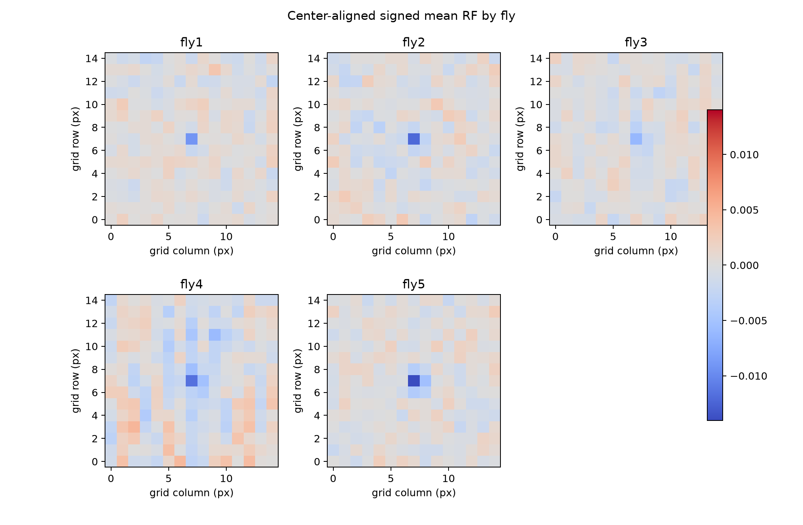
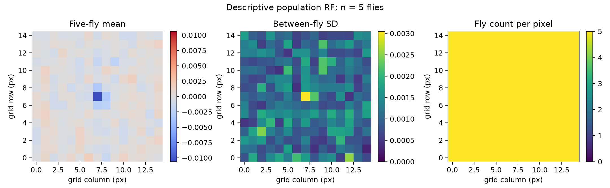
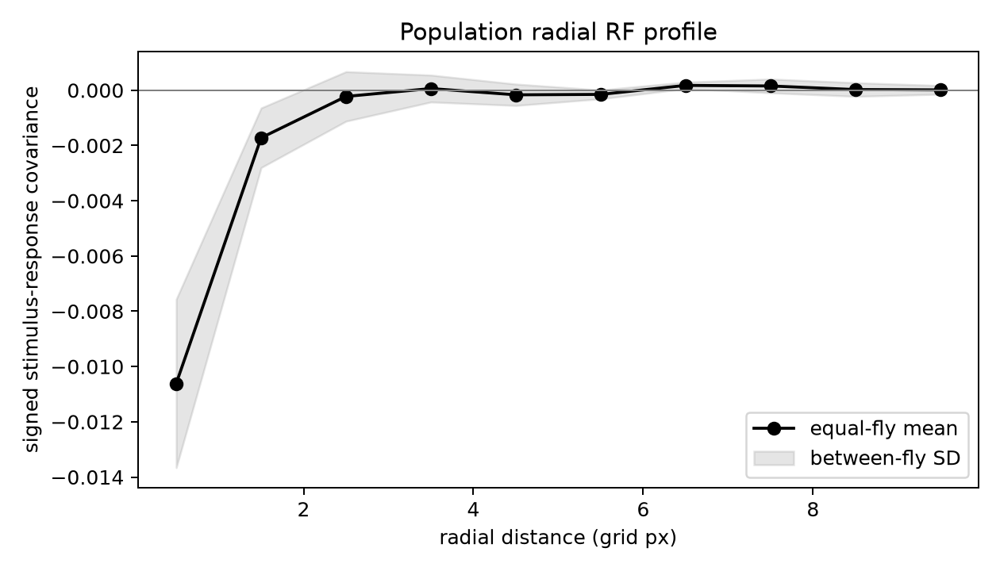
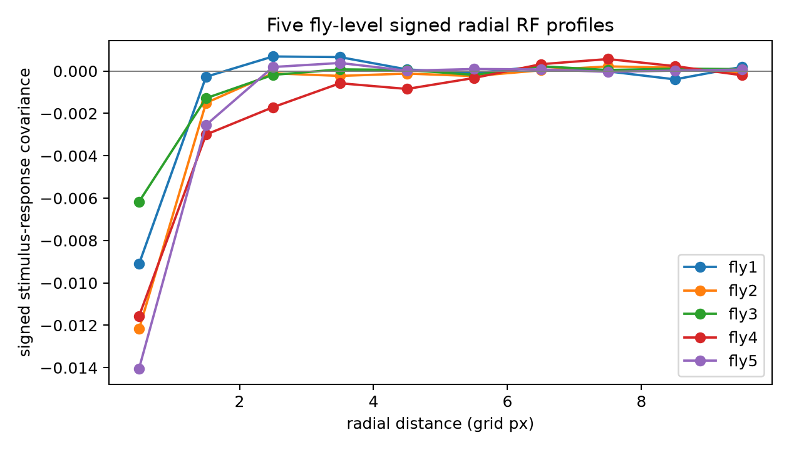
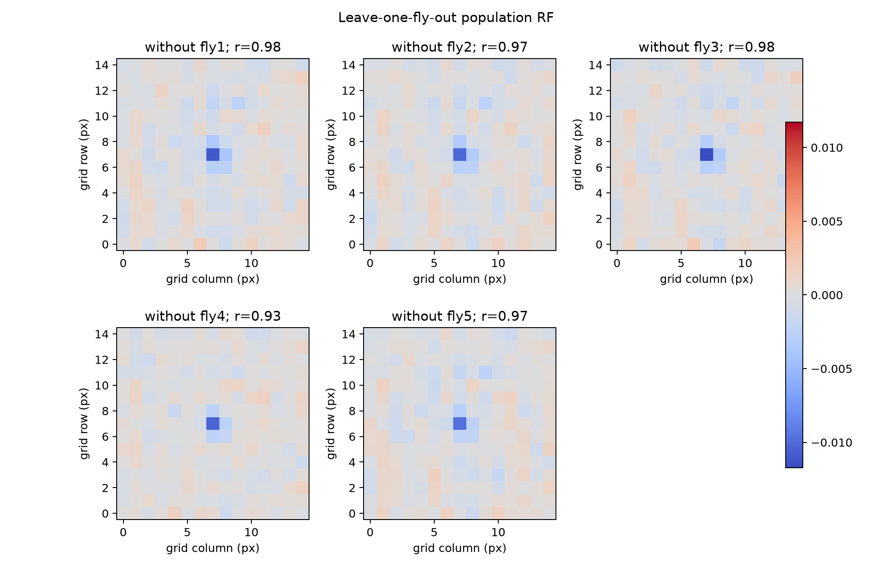
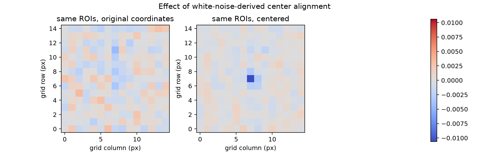
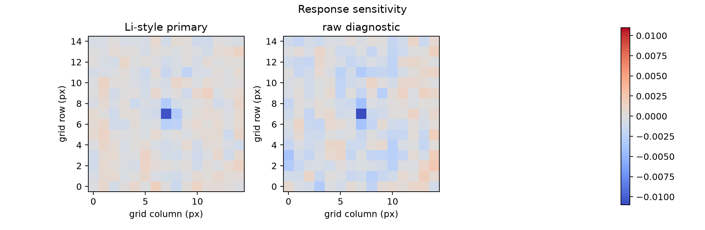
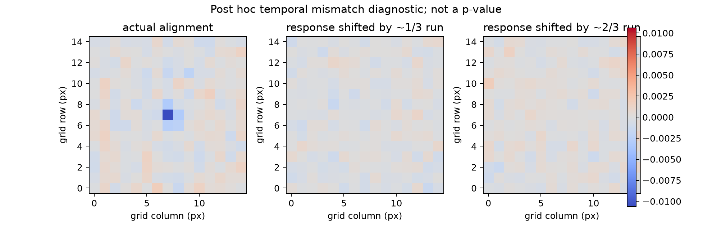

# Phase 6.2：五只 fly 的描述性群体感受野

**分析性质：FULL-DATA DESCRIPTIVE ANALYSIS。** 本阶段使用每次记录的全部可用白噪声片段，生物学重复单位是 **5 只 fly**，不是 236 个独立 ROI。没有独立刺激序列、独立定位实验或留出的确认数据。本报告中的“响应”是 `Results.csv` 的 ROI 平均图像强度经指定变换所得；尚未核实为正式校正后的 Dm8 钙信号。`UV-15Hz` 是目录标签，不代表实测波长或辐照度。

## 直接结论

五只 fly 的中心对齐平均 RF 均呈**负向中心趋势**，五只都在去掉任何一只 fly 后维持该趋势。全体 228 个可对齐 ROI 中有 169 个中心像素为负。这是一项可讲解的**描述性群体发现**。环绕区在五只 fly 间符号不一致，群体环绕均值也没有与中心相反的符号，所以当前数据**不支持确认性的 center–surround antagonism 或 DoG 参数解释**。负中心与 Li 等 2021 报道的 Dm8 中心抑制方向相容；本结果没有复现其完整生理机制。

## 数据与固定流程

1. 从五次实验各自保存的 15×15 数字白噪声、`Results.csv`、DLP/Zeiss TTL 建立刺激到成像帧的对应。五只 fly **共用一条冻结数字刺激**；显示命令不是物理光刺激测量。
2. 每次 payload 约 8,119 帧，40 个刺激更新的历史要求使每次有 **8,084 个 RF 样本帧**。没有使用 train/validation/test 分割，也不能再把这些帧当独立验证集。
3. 主响应固定为 Li-style 离线表示：`F_raw − Gaussian_σ=10s(F_raw)`；反射边界，并保留完整 payload。这个处理读取前后时间点，只适合离线 RF 描述。raw 强度作为事先指定的敏感性检查。每 ROI 用其全 payload 响应标准差定尺度，所以 RF 值是数字刺激与标准化响应的带符号协方差尺度，不是 ΔF/F、光强或角度。
4. 40 个过去更新按 4×10 分箱，反向相关核为 `[4,15,15,ROI]`；四箱带符号平均得到空间图。时间历史只用当前及过去刺激。与旧的高自由度逐更新核相比，本估计器的方差较低。配置见 [`phase6_2_population_rf.json`](../configs/phase6_2_population_rf.json)，主方法参数在首次全数据运行前固定，配置 SHA-256 为 `03dc89281ef42a7eeac18dbcefb347ee26c6910fb4cf4aaa0b1e744d71fe99a9`。后加的两次错位诊断明确属于**事后检查**，不改变主估计器或纳入规则。
5. 仅剔除非有限、高零比例（≥20%）、常量或中心数值拟合失败的 ROI；**不使用 Phase 6.1 的 p 值、`RF_RELIABLE` 标签或结果符号筛选**。中心来自同一白噪声 RF 的 Gaussian 估计；能量质心另存作敏感性参考。前/后半中心位移 >2 网格像素标记 `CENTER_UNCERTAIN`，但仍纳入主平均。没有独立 moving-bar localizer。
6. 把有效中心以最近整数位移对齐到 `(7,7)`；边缘裁剪为 NaN 并记录有效像素掩码，**绝不环绕**。先在各 fly 内等权平均 ROI，再对五只 fly 等权平均，并按像素实际有效贡献数计算。1D 曲线是中心对齐后按网格像素半径分箱的带符号径向平均。

源码入口：[`run_population.py`](../modeling_pipeline/phase_06/run_population.py)；核心实现：[`phase62.py`](../src/dm8_modeling/experiments/phase62.py)、[`population.py`](../src/dm8_modeling/rf/population.py)。运行：

```bash
OPENBLAS_NUM_THREADS=2 .venv/bin/python modeling_pipeline/phase_06/run_population.py --workspace-root .
```

派生的逐 ROI、逐 fly、群体数值及 SHA-256 manifest 写到 `outputs/phase_06/population_rf/`；关键数值副本在 [`phase6_2_results/`](phase6_2_results/)（`summary.json`、两个 CSV、群体 NPZ），主要图副本在 [`phase6_2_figures/`](phase6_2_figures/)。所有网格长度均以 **px** 表示，不能换算为视角 degrees。

## 主要数值与图

| fly | 原 ROI | 有效及对齐 ROI | 中心标记不稳定 | 中心像素为负 ROI | 中心区域均值 | 环绕区域均值 |
|---|---:|---:|---:|---:|---:|---:|
| fly1 | 42 | 40 | 27 | 25 | −0.001253 | +0.000125 |
| fly2 | 50 | 48 | 23 | 40 | −0.002691 | −0.000217 |
| fly3 | 50 | 46 | 31 | 28 | −0.001826 | −0.000030 |
| fly4 | 48 | 48 | 26 | 39 | −0.003952 | −0.000575 |
| fly5 | 46 | 46 | 19 | 37 | −0.003825 | +0.000130 |
| **合计 / 等权群体** | **236** | **228** | **126** | **169** | **−0.002709** | **−0.000114** |

中心区域预定为半径 ≤1.5 px；环绕区域为 3–6 px。8 个 ROI 均因原始 trace 零值比例过高而未进入对齐均值。fly4 的中心最强，图上还有明显条纹/背景结构；其方向与其他 fly 相同，但不能忽略其差异。中心不稳定标记在 126/228 个 ROI 出现，是单细胞定位可信度有限的重要提示。











每像素的 fly 贡献数为 5。图 3 的负中心随着半径增大快速趋近零；没有稳定的正向环。去掉 fly1–fly5 后，所得图与全图的像素相关分别是 **0.979、0.971、0.983、0.929、0.974**，中心区仍全为负。这个“留一 fly”只检查已观察样本的敏感性；每张四 fly 图与全图共享 4/5 数据，相关高不能视为外部预测或显著性。

### 对齐与响应敏感性

同一批 ROI 的五张 fly 平均图在对齐前跨 fly 成对相关中位数 **−0.028**，对齐后 **+0.349**。但是 fly 内 ROI 图成对相关中位数为：fly1 `0.132→0.026`、fly2 `0.242→0.070`、fly3 `0.336→0.003`、fly4 `0.519→0.047`、fly5 `0.052→0.087`。因此只能说**对齐后 fly 层面的平均图更一致**；不能说 ROI 层面整体更一致。中心由同一数据估计，均值图的增强也可能部分包含同数据定位/选择偏差。



raw 强度诊断的群体中心/环绕区均值是 `−0.002782 / −0.000568`，负中心没有依赖 Li-style 预处理才出现；环绕结论仍不成立。两次**事后**完整响应错位（约 1/3 与 2/3 记录长度）所得中心像素为 `−0.000225 / +0.000139`，主结果为 `−0.010613`。这降低了“任何错位也会必然生成同样强的负中心”的担忧，但仅两次事后对照，**没有 p 值、没有确认性零分布**。





## DoG 决策和科学证据等级

预设的描述性 DoG 门槛要求：群体中心与环绕符号相反、至少 4/5 fly 的两区方向一致、所有留一 fly 图维持该极性。实际群体中心和环绕同为负，只有 **2/5** fly 的环绕为正，因此门槛失败；**未拟合 DoG，也没有 Figure 6、中心/环绕宽度或幅度参数**。不能因图中的局部浅色斑块称为可靠环绕兴奋。

| 等级 | 目前能说什么 |
|---|---|
| Level 1：数据事实 | 保存的数字刺激与 ROI 强度可重建 5 张 fly 图、1 张等权群体图；228 个可对齐 ROI；保留逐 ROI 纳入、中心、掩码与来源哈希。 |
| Level 2：稳健描述趋势 | 五只 fly 的平均 RF 都是负向中心；raw 检查与五次留一 fly 图维持该方向。这里“稳健”只指这些预定敏感性检查。 |
| Level 3：与文献相容 | Li 等（2021）报告 Dm8 在其条件下有中心抑制/环绕兴奋。本数据的**负中心方向**与其中心分量相容；环绕分量未得到支持。 |
| Level 4：当前不支持 | 精确复制文献 RF 宽度、证明拮抗机制、显著的个体 ROI RF、独立中心定位、对新 fly/刺激的预测、全部 Dm8 神经元共享此 RF、物理波长/辐照度效应。 |

文献依据：仓库外本地阅读材料 `color_modify_research/papercore/2021_Li_NeuralMechanismSpatioChromaticOpponencyDrosophila.pdf`（结果部分的 Dm8 描述与方法部分的离线响应处理）。文献实验条件与本项目的信号来源和物理刺激标定不能直接视为相同。

## 九个研究问题的结论

1. **各 fly 是否有可辨认结构？** 平均图均可见负向中心；ROI 级中心有较高不稳定比例，不得上升为每个 ROI 都有可靠 RF。
2. **对齐是否提高一致性？** 跨 fly 平均图相关提高；fly 内 ROI 相关在 4/5 中下降，结论必须分层。
3. **是否有 center–surround-like organization？** 中心清楚，可靠的反号环绕不足。
4. **极性？** 群体中心负，环绕均值弱负且 fly 间混合。
5. **留一 fly 稳定吗？** 负中心稳定；fly4 移除带来最大图形变化。
6. **1D 是否支持中心加环绕？** 负中心及近零外围；不支持可靠的相反符号分量。
7. **DoG 合理吗？** 预设门槛未通过，未拟合。
8. **与 Li 2021 哪里一致？** 仅中心抑制方向相容。
9. **尚不能支持什么？** 独立验证、准确 RF 尺度、确认性中心–环绕机制、群体外推和生理信号/光谱定量解释。

## 毕业设计讲解建议

可用一条清楚的证据链：**一条冻结刺激与五只 fly 的 ROI 记录 → 统一时钟与离线响应 → 每 ROI 粗时间 RF → 白噪声估计中心 → 每 fly 等 ROI 权重 → 五 fly 等权群体图 → 留一 fly 与 raw 对照 → “负中心可描述，环绕未证实”**。讲解时同时展示图 1–5 和不稳定中心比例。Phase 6.1 的 `0/236 RF_RELIABLE` 与这里的群体平均趋势回答不同问题，不互相推翻。
