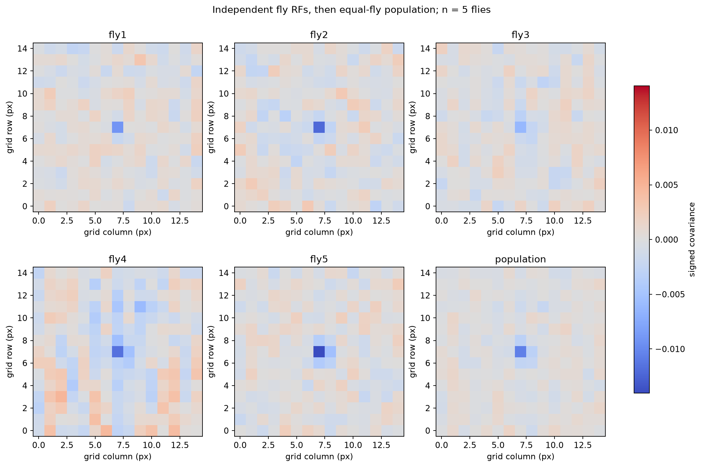
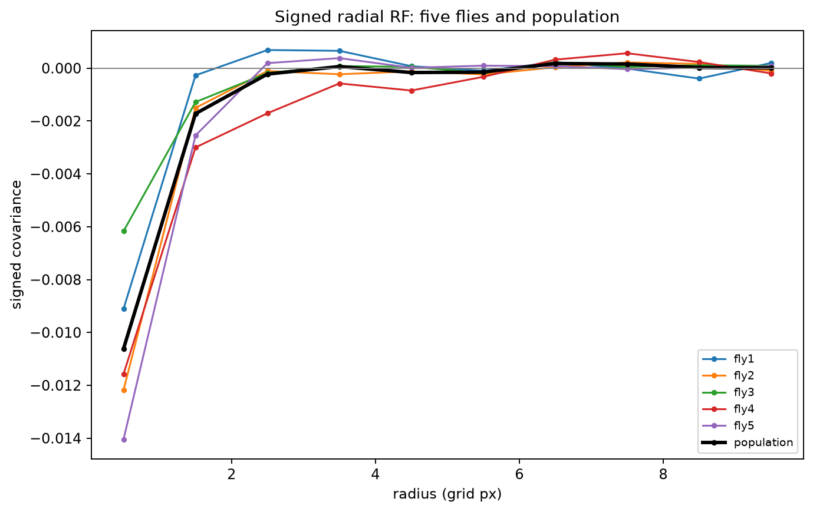
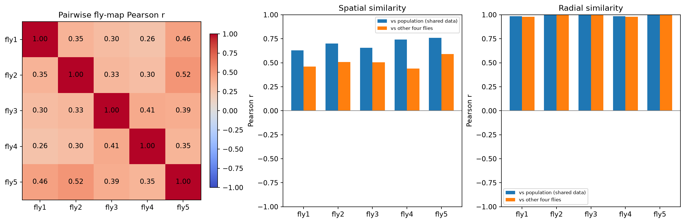
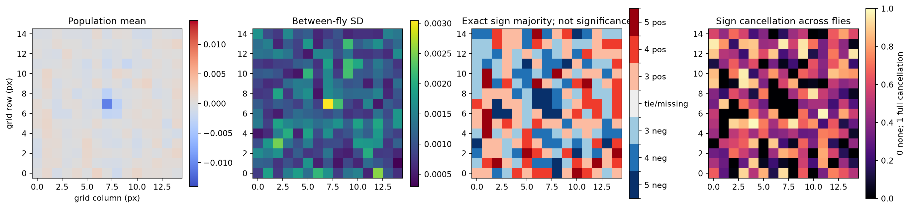
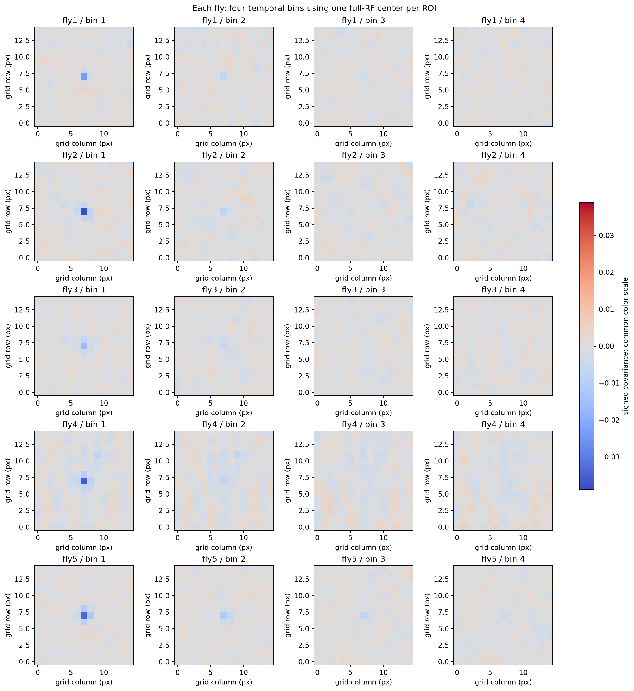
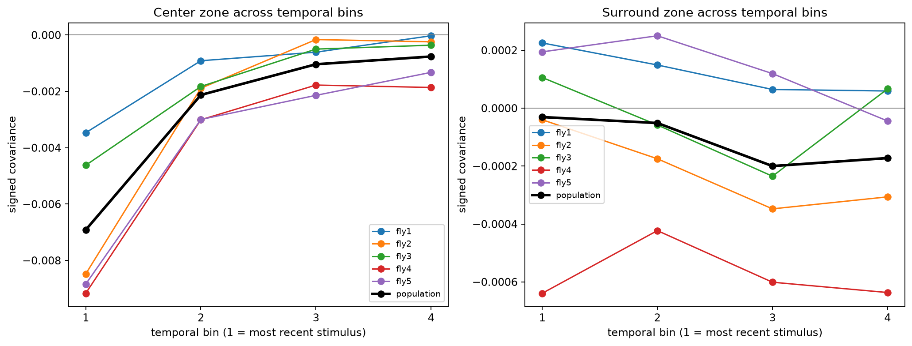
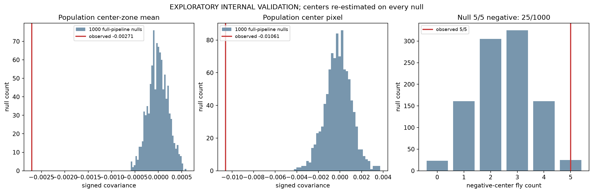
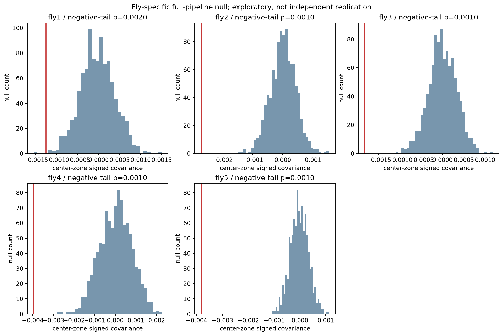
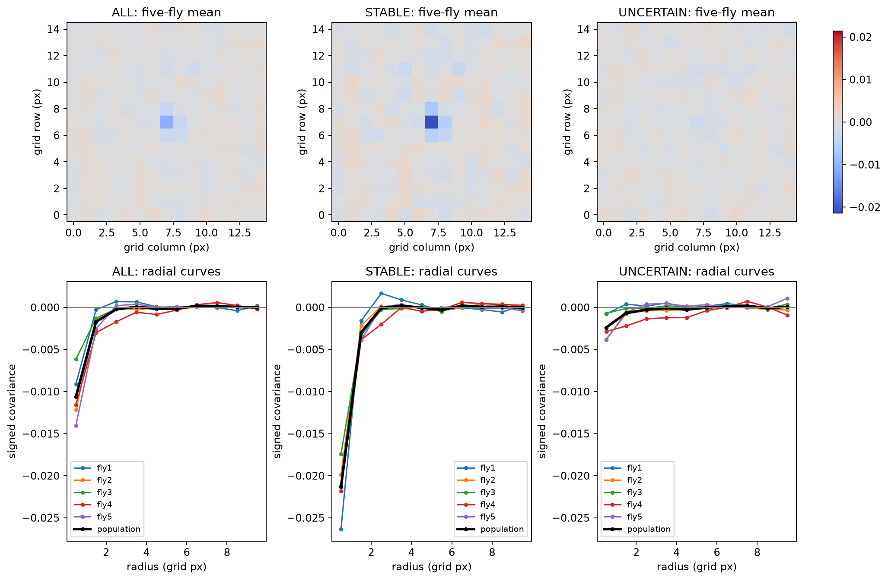

# Phase 6.3：五只 fly 的 RF 共性、异质性与完整零模型

**结论：负向中心是五只 fly 分别支持的共同分量，且超过重新定位所产生的内部零模型偏差；环绕是较弱、位置/时间/极性不一致的分量，当前仍不能称为共同的环绕兴奋。** 本轮在 Phase 6.2 commit `c03dd3e084ad2e4a51a981dea0e36e7fc725131d` 基础上完成，五只 fly 分别分析结束后才计算等权群体结果。所有推断标记 **EXPLORATORY INTERNAL VALIDATION**：数据此前已看过，零模型没有提供新动物、新刺激或新的物理测量。

实验输入是已保存的 15×15 数字白噪声、`Results.csv` 的 `MeanN` ROI 平均图像强度与 DLP/Zeiss 时钟。五次 recording 共用一条冻结刺激。每次全部 payload 约 8119 帧中有 8084 帧满足 40 更新历史；主响应固定为 raw 减 σ=10s Gaussian 慢基线的离线表示，8,084 帧尺度标准化。Gaussian、零比例、中心拟合、2px 稳定阈值及 1.5px/3–6px zones 均沿用 Phase 6.2。当前没有独立 moving-bar localizer；中心由同一白噪声核导出。原始 ROI 强度尚未核实为正式校正钙响应，数字命令未提供实测波长/辐照度。

## 一眼看到的共性与差异

下表 RF 强度按 **×10⁻³** 显示，单位为数字刺激与标准化 ROI 平均强度的协方差尺度；它不是 ΔF/F、照度或纯粹的神经响应幅度。稳定比例的群体列是五 fly 等权均值。

| Feature | fly1 | fly2 | fly3 | fly4 | fly5 | Population | Interpretation |
|---|---:|---:|---:|---:|---:|---:|---|
| 中心极性 | 负 | 负 | 负 | 负 | 负 | 负 | CONSERVED |
| 中心区强度 ×10⁻³ | −1.253 | −2.691 | −1.826 | −3.952 | −3.825 | −2.709 | 同方向，幅度有差异 |
| 环绕极性 | 正 | 负 | 弱负 | 负 | 正 | 弱负 | HETEROGENEOUS |
| 环绕区强度 ×10⁻³ | +0.125 | −0.217 | −0.030 | −0.575 | +0.130 | −0.114 | 接近零包含反号抵消 |
| 最强中心时间箱 | 1 | 1 | 1 | 1 | 1 | 1 | CONSERVED short-lag dominance |
| CENTER_ESTIMATED 比例 | 32.5% | 52.1% | 32.6% | 45.8% | 58.7% | 44.3% | 定位质量不均 |
| 中心区 null 负尾 p | 0.001998 | 0.000999 | 0.000999 | 0.000999 | 0.000999 | 0.000999 | 刺激对应的探索性证据 |

总计 236 ROI，228 个可对齐；102 个 `CENTER_ESTIMATED`、126 个 `CENTER_UNCERTAIN`。稳定组的 102/228 是 ROI 描述比例（44.7%），不等于 102 个独立动物。主分析仍保留全部 228 ROI 和全部 5 fly。





## 各 fly 分别告诉我们什么

| fly | 对齐 ROI / 总 ROI | 稳定 / 不稳定中心 | 中心位移中位数 px | ROI 图相似度：对齐前 → 后 | 个体结果 |
|---|---:|---:|---:|---:|---|
| [fly1](phase6_3_individual/fly1.md) | 40/42 | 13/27 | 6.202 | 0.132 → 0.026 | 中心最弱，主环绕弱正；稳定组中心增强明显，不稳定组中心区略正。 |
| [fly2](phase6_3_individual/fly2.md) | 48/50 | 25/23 | 0.559 | 0.242 → 0.070 | 较清楚负中心；四箱主环绕都负。 |
| [fly3](phase6_3_individual/fly3.md) | 46/50 | 15/31 | 5.531 | 0.336 → 0.003 | 较弱负中心；环绕时间反号最明显，积分均值近零。 |
| [fly4](phase6_3_individual/fly4.md) | 48/48 | 22/26 | 3.223 | 0.519 → 0.047 | 中心区最强、空间背景/条纹更突出；四箱环绕都负，null 较宽。 |
| [fly5](phase6_3_individual/fly5.md) | 46/46 | 27/19 | 0.675 | 0.052 → 0.087 | 稳定比例最高；中心像素最负；前三箱环绕正，末箱弱负。 |

五张独立报告分别包含原坐标图、对齐图、径向曲线、四箱图及径向数值、中心/环绕轨迹、纳入与中心稳定性、完整零模型。每只 fly 的尺度、中心、特征、纳入都未使用其他 fly 的响应。其中心区幅度最大/最小比 **3.15**，群体中心均值 `−0.002709`，fly 间 SD `0.001193`；这体现记录层级的异质性，不能直接当作生理强度差异。SD 是五 fly 的离散程度，**不是置信区间**。

169/228 个 ROI 的中心像素为负，但这些 ROI 不是独立生物重复。对齐后 fly 内 ROI 相似度在 4/5 中下降，说明不能把群体图的相似性解释为所有 ROI 的全空间结构一致。

## fly 与 population：共同中心与异质外围

| fly | 与 population 空间 r | 与其余四 fly 空间 r | 与其余四 fly 径向 r | 与 population 中心时间 r |
|---|---:|---:|---:|---:|
| fly1 | 0.630 | 0.459 | 0.979 | 0.993 |
| fly2 | 0.700 | 0.508 | 0.997 | 0.999 |
| fly3 | 0.657 | 0.505 | 0.997 | 0.991 |
| fly4 | 0.741 | 0.439 | 0.978 | 0.998 |
| fly5 | 0.759 | 0.592 | 0.997 | 0.998 |

fly vs population 共享该 fly 的数据，所以另列与**其余四 fly**的比较。五 fly 两两二维图相关范围 **0.264–0.522**；径向相似度很高，主要受共同负中心及趋零外围支配，不能用它证明环绕一致。四点时间相关也只描述形状，不提供精确延迟或独立统计检验。所有空间、径向、中心/环绕时间相关及相对群体的 zone 偏差见[比较表](phase6_3_results/fly_population_comparison.csv)。



225 个像素中：17 个是 5/5 负，38 个 4/5 负，54 个 3/5 负；14 个 5/5 正，36 个 4/5 正，66 个 3/5 正。**194/225 个像素含正负混合（86.2%）**。中心区的 9 个像素中有 6 个 5/5 负、2 个 4/5 负、1 个仅 2/5 负；中心像素本身是 5/5 负。3–6 px 环绕区 88 个像素只有 6 个 5/5 负、3 个 5/5 正，没有形成统一正向环。



共识图只统计精确符号，没有后验幅度门槛，也**不是像素显著性图**。极小噪声也可得到相同符号；外围零星 5/5 正像素不能称为共同环绕兴奋。应同时读均值、SD 和效应大小。

## 环绕为什么在平均图中弱

主环绕区的五 fly 值为 `+0.000125 / −0.000217 / −0.000030 / −0.000575 / +0.000130`，均值 `−0.000114`、SD `0.000294`、范围 `−0.000575…+0.000130`。因此“所有 fly 都没有外围分量”不准确；有反号和幅度异质性，但除 fly4 的较强负外围外，主 zone 数值普遍远小于中心。

固定的描述性抵消指标为 `1 − |mean(values)| / mean(|values|)`：0 表示没有反号抵消，1 表示完全抵消。环绕跨 fly 的抵消率 **47.3%**，中心为 **0%**。这解释了平均数的数学衰减，不证明被抵消的都是可靠生物信号。

外周径向峰在既有径向箱 lower edge≥2 px 中报告，**不重定义主环绕区**：

| fly | 外周最大绝对峰：半径 px / 强度 ×10⁻³ | 正峰：半径 px / 强度 ×10⁻³ |
|---|---|---|
| fly1 | 2.5 / +0.686 | 2.5 / +0.686 |
| fly2 | 5.5 / −0.239 | 7.5 / +0.217 |
| fly3 | 6.5 / +0.224 | 6.5 / +0.224 |
| fly4 | 2.5 / −1.708 | 7.5 / +0.564 |
| fly5 | 3.5 / +0.379 | 3.5 / +0.379 |

正峰位置 2.5–7.5 px 不一致；部分在主 3–6 px zone 外，fly1 的 2.5 px 分量也可能与中心边缘有关。外周峰是从多个半径中挑出的描述值；[径向 null 表](phase6_3_results/radial_null_diagnostics.csv)是未调整的逐半径诊断。fly1 的正峰逐半径双侧 p≈0.026，也不能把这个被选中的局部值当作确认性的 surround excitation；其余正峰的该诊断 p≈0.120–0.410。外围的裁剪、较少像素、中心误差和低信噪比仍影响解释。

最强证据目前是：**跨 fly 的极性/幅度/径向位置确实不同；部分 fly 还存在时间反号。** “环绕因为 SNR 不足”“定位错误模糊了真实正环绕”仍是可能解释，当前不能量化出唯一原因。

## 四时间箱揭示什么

参数沿用 4×10 个过去刺激更新，名义 15 Hz 下 bin1 是 lag0–9（约 0–0.6s），bin2 lag10–19，bin3 lag20–29，bin4 lag30–39（约 2.0–2.6s）。每 ROI 用同一个 full-RF 中心对齐所有箱，保留符号，避免逐箱重新找 peak 制造时间图。此时间轴是刺激历史窗口，**不是钙/神经延迟的精确测量**。



| 中心区 ×10⁻³ | bin1 | bin2 | bin3 | bin4 |
|---|---:|---:|---:|---:|
| fly1 | −3.467 | −0.911 | −0.608 | −0.025 |
| fly2 | −8.477 | −1.888 | −0.160 | −0.240 |
| fly3 | −4.621 | −1.826 | −0.499 | −0.360 |
| fly4 | −9.165 | −3.006 | −1.775 | −1.861 |
| fly5 | −8.838 | −2.997 | −2.140 | −1.324 |
| population | −6.914 | −2.126 | −1.036 | −0.762 |

| 环绕区 ×10⁻³ | bin1 | bin2 | bin3 | bin4 |
|---|---:|---:|---:|---:|
| fly1 | +0.225 | +0.149 | +0.065 | +0.059 |
| fly2 | −0.040 | −0.175 | −0.348 | −0.306 |
| fly3 | +0.106 | −0.058 | −0.235 | +0.067 |
| fly4 | −0.639 | −0.423 | −0.601 | −0.637 |
| fly5 | +0.194 | +0.250 | +0.119 | −0.044 |
| population | −0.031 | −0.051 | −0.200 | −0.172 |



中心在所有 fly、所有四箱都负，且 **5/5 最强是 bin1**；没有中心峰值错相导致的反号抵消。四箱平均会稀释最强的短 lag 分量，但这与正负抵消不同。

环绕则存在异质性：fly1 四箱正、fly2/fly4 四箱负；fly3 正→负→负→正，fly5 末箱转弱负。fly3 的四箱反号抵消 **74.1%**，fly5 **14.6%**；其余 fly 为 0%。同一箱的跨 fly 环绕抵消率分别 **87.3%、75.7%、26.9%、22.6%**。这是时间/动物平均隐藏差异的明确描述证据，却未发现一个五 fly 共享的正环绕箱。

每个 zone/bin 的五个值、等权 mean、range、SD、正负数和抵消率见[统一表](phase6_3_results/zone_temporal_summary.csv)；四箱各 fly 的径向数值见[径向表](phase6_3_results/temporal_radial_profiles.csv)。

## 正式的 full-pipeline null

运行前计划见[全局假设审计](PHASE6_3_ASSUMPTION_AUDIT.md)与[运行前哈希记录](phase6_3_results/pre_run_provenance.json)。固定配置 SHA-256 为 `e48824d509f495bbe95d95aa67783b94d6c07ddacb1071edf95bf112496597a9`，seed `6320260930`，每 fly **1000 次**。从 circular 距离至少 60 秒的 raw payload 帧偏移中独立、均匀、有放回抽样；同 fly 所有 ROI 一起平移，保留其共同波动。

每次执行：**平移完整 raw → 相同 Li-style Gaussian → 相同可用帧尺度 → 相同粗时间 RF → 新 Gaussian 中心 → 新 NaN 无环绕对齐 → 新 fly 均值**。技术有效规则和中心拟合规则相同；中心拟合失败留作 missing。主纳入不依赖 stable 标签，因此 null 不以真实稳定 ROI 或真实中心筛选。五张独立 null fly 图完成后才等权合成每次 population。

各 fly 的 null 有效 ROI 范围分别 39–40、46–48、45–46、46–48、45–46；每次群体每像素均有 5 fly 贡献。与真实中心相比，每次至少 39/47/45/46/45 个中心改变，确认**没有固定真实中心给 null**。每 fly 1000 个偏移中有 920–944 个唯一值，有放回重复是抽样设计的一部分，不是额外生物重复。

主负尾 p 为 `(1 + count(null≤observed))/(1000+1)`，最低可分辨值是 **0.000999**，不能写成 p=0。五 fly 与 population 六个中心区主检验给出 BH6 作为探索性参考；中心像素、最大绝对幅度和径向诊断是另外的敏感性统计，不按它们择优更改主指标。

| unit | 观测中心区 | null 2.5% / 中位 / 97.5% | 负尾 p | BH6 q |
|---|---:|---|---:|---:|
| fly1 | −0.001253 | −0.000816 / −0.000024 / +0.000776 | 0.001998 | 0.001998 |
| fly2 | −0.002691 | −0.000816 / +0.000019 / +0.000814 | 0.000999 | 0.001199 |
| fly3 | −0.001826 | −0.000661 / −0.000013 / +0.000654 | 0.000999 | 0.001199 |
| fly4 | −0.003952 | −0.001501 / +0.000040 / +0.001482 | 0.000999 | 0.001199 |
| fly5 | −0.003825 | −0.000712 / −0.000027 / +0.000684 | 0.000999 | 0.001199 |
| population | −0.002709 | −0.000410 / −0.000007 / +0.000417 | 0.000999 | 0.001199 |

fly1 的零模型有 1 次中心区更负，其他四 fly 及 population 均为 0 次。观测群体中心约为 null 2.5% 分位数幅度的 **6.6 倍**；这不是神经效应量标定，但说明观测图超出此零模型尺度。中心像素的负尾 p 在 fly4 为 **0.007992**（其余均 0.000999）；中心区最大绝对幅度上尾 p 在 fly4 为 **0.022977**（其余均 0.000999），反映 fly4 的空间/噪声分布不同。[完整检验表](phase6_3_results/null_tests.csv)保留全部统计。





null 中负中心 fly 数为 0/1/2/3/4/5 的次数是 **23/161/305/325/161/25**。真实 5/5 负在 null 中出现 **25/1000=2.5%**，plus-one 尾部概率 **26/1001≈0.02597**。联合计数从独立 fly 平移计算，未假设二项公平符号。符号一致性和幅度零模型共同支持负中心具有**刺激对应的探索性内部证据**。

这个 null 控制了“重新寻找 RF 中心”本身的偏差，但依赖时间平移的近似可交换性。反射基线、非平稳漂移和 circular seam 仍可能影响 null；它也无法区分真实神经视觉响应与刺激同步的成像/设备伪影。因此不能据此证明 Dm8 抑制机制或独立复现。

## 稳定中心分层：中心变强，环绕仍不统一

直接沿用 Phase 6.2 的 ≤2 px 前后半中心位移规则：`CENTER_ESTIMATED` 是 STABLE，其他有效中心是 UNCERTAIN；不重新设阈值。每组先 fly 内平均，再五 fly 等权。

| 组 | ROI 总数 | fly 数 | 群体中心区 | 群体环绕区 | 正环绕 fly 数 |
|---|---:|---:|---:|---:|---:|
| ALL | 228 | 5 | −0.002709 | −0.000114 | 2/5 |
| STABLE | 102 | 5 | −0.005011 | −0.000120 | 2/5 |
| UNCERTAIN | 126 | 5 | −0.000855 | −0.000104 | 3/5 |



**每只 fly 的稳定组中心都更负**；等权群体稳定组约为 ALL 的 1.85 倍、不稳定组约为 ALL 的 0.32 倍。支持中心定位质量与清楚的中心分量相关。可是 STABLE 的环绕仍只有 fly1/fly5 正，不能把中心误差当作缺少共同正环绕的充分解释。稳定标签来自同一数据，与强信号可能共同出现；这不是独立验证或证明定位误差的因果效应。逐 fly 三组值见[分层表](phase6_3_results/center_stability_groups.csv)。

## fly4 影响：保留它，检查它改变了什么

| 指标 | 五 fly | 去掉 fly4 的四 fly |
|---|---:|---:|
| 中心区 | −0.002709 | −0.002399 |
| 环绕区 | −0.000114 | +0.000001809 |
| 中心时间轨迹 ×10⁻³ | −6.914 / −2.126 / −1.036 / −0.762 | −6.351 / −1.905 / −0.852 / −0.488 |
| 环绕时间轨迹 ×10⁻³ | −0.031 / −0.051 / −0.200 / −0.172 | +0.121 / +0.042 / −0.100 / −0.056 |

去掉 fly4 后中心区幅度减少约 **11.5%**，负中心与 bin1 优势保留；主环绕从弱负转为几乎零，早期环绕轨迹转弱正。这说明 fly4 对外围背景和晚 lag 分量有影响，**主要负中心结论不依赖它**。没有技术排除证据，所以 fly4 始终纳入 primary。

[fly4 时间影响图](phase6_3_figures/supplement_fly4_influence.png)、[全部 LOFO 时间曲线](phase6_3_figures/supplement_lofo_temporal.png)、[原坐标五 fly 图](phase6_3_figures/supplement_unaligned.png)供检查。Phase 6.2 的五次 LOFO 图都保留负中心；共享数据的 LOFO 图相关不等于外部验证。

## 证据等级与 16 个问题的回答

| 级别 | 本批数据目前支持的表述 |
|---|---|
| Level 1：直接事实 | 五 fly 的独立图、四箱轨迹、236/228/102/126 纳入计数、零分布与偏移、符号/幅度表。 |
| Level 2：内部稳健描述 | 5/5 负中心、5/5 bin1 最强、raw 检查保留方向、稳定中心组更清楚、去掉任意 fly 负中心仍在。 |
| Level 3：刺激对应的探索性证据 | 单 fly 与群体中心超出完整重新定位的时间平移 null；5/5 负中心 null 频率 2.5%。 |
| Level 4：与文献相容的解释 | 负中心方向与 Li 2021 的 center-inhibitory component 相容；当前没有支持其完整 center-inhibition/surround-excitation RF。 |
| Level 5：需要新实验/当前不支持 | 独立中心、单 ROI 确认性 RF、可靠环绕兴奋、精确生理宽度/延迟、真实钙信号校正、物理光谱/照度、神经机制与跨刺激/动物外推。 |

1. **各 fly 的 RF？** 五张图都有负中心；外围与定位稳定性各不相同，详见五张独立报告。
2. **是否五个独立 fly-level 分析支持？** 是，各自 RF/中心/尺度只用自身响应，且各自 null 支持负中心；“独立分析”仍不是独立新实验验证。
3. **强度差多少？** 中心区幅度范围 0.001253–0.003952，约 3.15 倍，标准化尺度下比较。
4. **群体平均强化共性？** 共同负中心保留并在群体 null 下更突出；不能扩展为所有像素/ROI 一致。
5. **削弱其他结构？** 主环绕跨 fly 反号抵消 47.3%；原空间背景和位置不同的外围分量也被均值掩盖。
6. **环绕不一致原因？** 极性/幅度/径向位置异质性证据最直接；fly3 时间反号明显。SNR 与定位误差的因果份额未确定。
7. **时间分解发现了被平均结构？** fly3 环绕 74.1% 时间抵消、fly5 14.6%；没有五 fly 共享的正环绕时段。
8. **稳定中心更干净？** 中心在 5/5 中更强，环绕没有变为统一正向。
9. **full-pipeline null 支持刺激关联？** 支持 Level 3 的内部探索性关联；不能排除同步伪影。
10. **5/5 negative 在 null 多常见？** 25/1000=2.5%。
11. **fly4 改变主结论？** 影响环绕符号、背景和时间尾部；负中心主结论保留。
12. **CONSERVED？** fly-level 负中心、最强 bin1、稳定中心组增强。
13. **HETEROGENEOUS？** 外围极性/幅度/径向峰位置、环绕时间轨迹、定位稳定比例、fly4 背景。
14. **UNRESOLVED？** 外围是真实生物信号还是噪声/伪影、中心定位的独立准确性、校正后的钙信号含义与 RF 物理标定。
15. **与 Li 2021 一致到哪里？** 中心方向相容；环绕、宽度、独立定位、完整机制没有复现。文献依据沿用[Phase 6.2](PHASE6_2_POPULATION_RF.md)的本地 Li 2021 原文核验。
16. **是否值得继续挖这五次记录？** 主要自定位/平均抵消问题已得到直接检查；继续换参数或增加图的边际收益有限。当前足以形成可解释毕业设计，强机制、独立中心和环绕结论需要新增定位/重复刺激或成像来源证据。本阶段完成后停止，由用户确定下一步。

## 复算、验证与交付

```bash
.venv/bin/python -m unittest discover -s tests -q
OPENBLAS_NUM_THREADS=2 .venv/bin/python modeling_pipeline/phase_06/run_validation.py --workspace-root .
```

代码仅新增 Phase 6.3 入口、独立编排、统计与作图；没有恢复预测模型、按 fly 调参、修改 zone/中心阈值、删 fly 或强行 DoG。Phase 6.2 的输入/输出 manifest 在运行前后均核验，观测图逐 fly 数值匹配基线。独立重新计算验证了群体均值、四箱积分、相关矩阵、共识计数及 population 经验 p；28 个测试通过，无新增依赖。17 张图已视觉检查，分层曲线共享纵轴；只修正图轴/文字，没有重跑或改动 null 数据。

当前完整输出在 `outputs/phase_06/fly_population_validation/`，manifest 记录 540 个声明输入与 36 个输出的 SHA-256。Git 中的[结果快照](phase6_3_results/)包含五 fly 观测核/中心/掩码、1000 次 null 的地图/径向/统计量/偏移、群体数组、CSV 与验证记录；[图目录](phase6_3_figures/)包含主图 1–9、补图及五 fly 单独图。`Dm8_module/` 与 `simulate/` 共 **4949 个文件**的本轮前后完整 SHA-256 清单一致（含操作系统元数据），本轮未修改来源。

已修正 Phase 6.2 文档中的尺度描述：Gaussian 使用完整 payload，实际标准差来自 8084 个 eligible RF 帧；算法与历史数值没有变化。运行前与运行后全局复查见[假设审计](PHASE6_3_ASSUMPTION_AUDIT.md)。**Phase 6.3 到此结束，未开展 Phase 6.4。**
