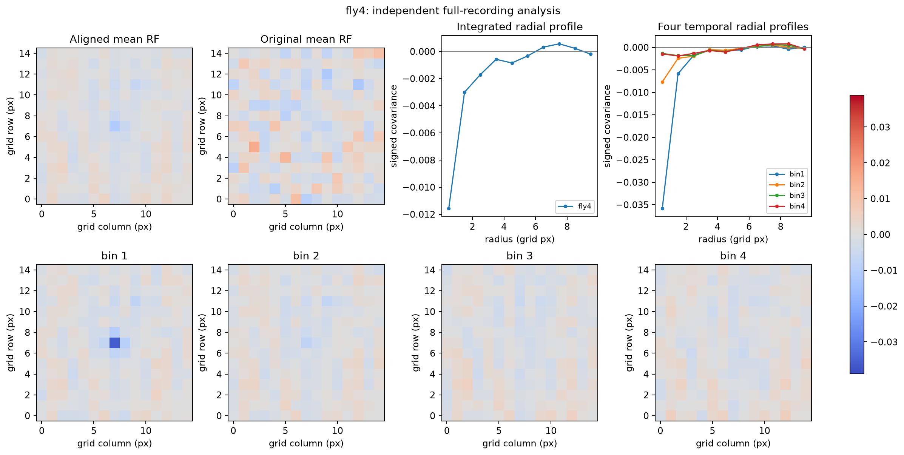

# fly4：独立全记录 RF 报告

Run `20260622_230745`。所有估计、中心、尺度、纳入与 1000 次零模型只读取本 fly 响应；群体比较见[主报告](../PHASE6_3_FLY_POPULATION_VALIDATION.md)。本记录是全数据探索性内部验证，不能作为独立确认。

中心区最强，原坐标图有明显条纹/背景；四箱环绕均为负。零模型中心区支持负向关联，但中心像素/中心最大幅度的尾部证据比其余 fly 弱，提示空间背景异质性。没有技术排除理由，保留于主分析。

| 指标 | 结果 |
|---|---|
| 原始 / 技术有效 / 中心对齐 ROI | 48 / 48 / 48 |
| CENTER_ESTIMATED / CENTER_UNCERTAIN | 22 / 26 |
| 稳定中心比例 | 45.8% |
| 负向中心像素 ROI 比例 | 81.2% |
| 中心区域均值 | -0.003952 |
| 环绕区域均值 | -0.000575 |
| 中心像素 | -0.011571 |
| 最强中心时间箱 | 1 |
| fly 内 ROI 相似度（前→后） | 0.519 → 0.047 |
| 前后半中心位移 Q25 / median / Q75（px） | 0.354 / 3.223 / 9.270 |
| 外周最大绝对径向峰（r≥2px） | 2.5px; -0.001708 |
| 中心区负尾经验 p / BH6 q | 0.000999 / 0.001199 |
| 中心像素负尾 p | 0.007992 |
| 中心最大绝对幅度上尾 p | 0.022977 |

## 四时间箱

各箱沿用同一 full-RF 中心，带符号核不翻转。更新频率名义 15 Hz：bin1 lag0–9，bin2 lag10–19，bin3 lag20–29，bin4 lag30–39；这些箱不是神经延迟的直接测量。

| bin | 中心区 | 环绕区 |
|---|---:|---:|
| 1 | -0.009165 | -0.000639 |
| 2 | -0.003006 | -0.000423 |
| 3 | -0.001775 | -0.000601 |
| 4 | -0.001861 | -0.000637 |

## 可查证数值

[本 fly signed 核/中心/掩码/分层 NPZ](../phase6_3_results/fly4_observed.npz)、[1000 次 null 的偏移/地图/径向/统计量](../phase6_3_results/fly4_null.npz)、[四箱径向数值表](../phase6_3_results/temporal_radial_profiles.csv)。图的 RF 单位是数字刺激与标准化 ROI 强度的协方差尺度，距离仅为网格像素。主要 zero-fraction、Gaussian sigma、中心阈值与 zone 均沿用 Phase 6.2，没有针对本 fly 调参。

中心区 null 的 2.5/50/97.5 分位数：-0.001501 / +0.000040 / +0.001482。p 值包含 plus-one 修正；本数据已看过，属于 EXPLORATORY INTERNAL VALIDATION。原始 Results.csv SHA-256：`962c2e36bb1b99449419ac6b6d23961cbc79fb127f7b531e8b2164bc0d40df17`。
